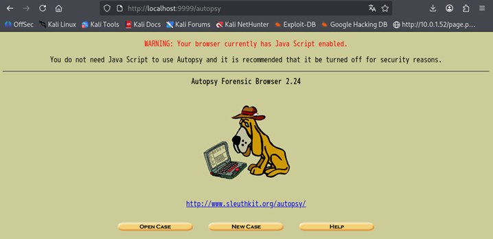
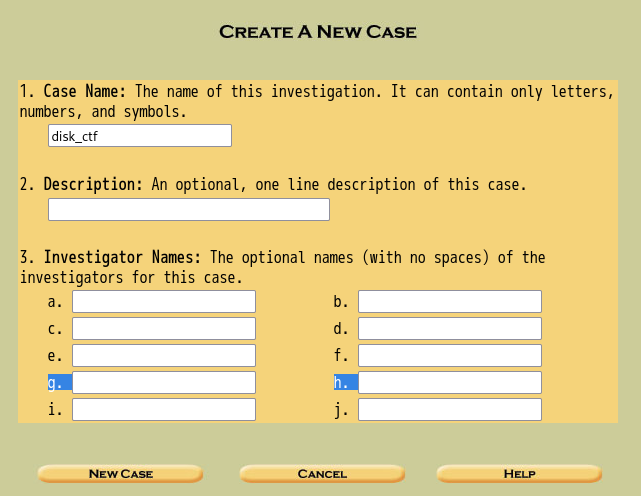
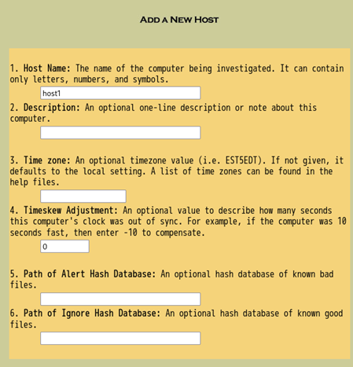
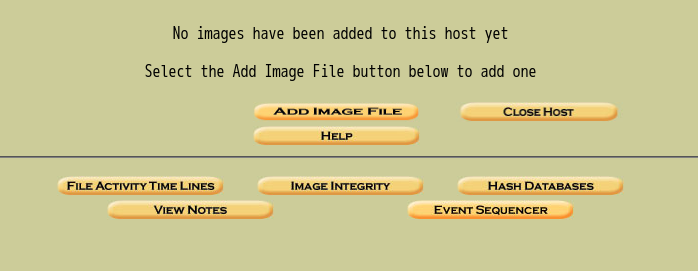
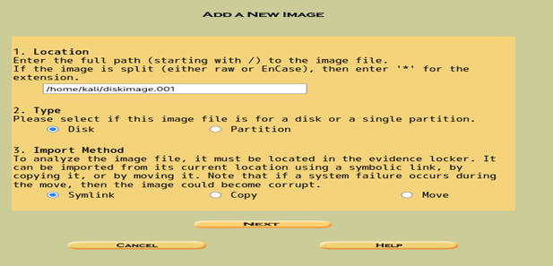
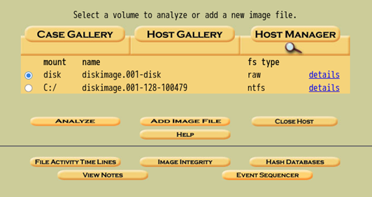
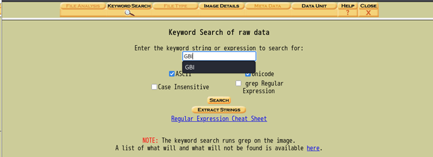
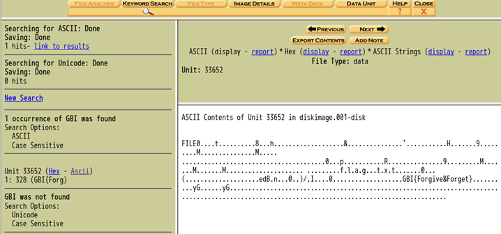

### 使用OS：Kali

stringsコマンドでもできるけど今回は「　**Autopsy**　」を使う

1.Autopsy起動
```bash
sudo autopsy
```
2.WEBでAutopsyサーバーにアクセスする
```bash
http://localhost:9999/autopsy
```

3.ブラウザが開いたら
  - NEW CASE
     
    - １番だけ記入して「NEW CASE」の内容は任意
     
    - HOST名も任意
  - ADDIMAGE
    
    ADDIMAGEボタンを押す
　- Add Data Source
   
    - ADD IMAGE FILEを押す
   
    - LOcationに解析するファイルの絶対パスを入れて「NEXT」
    - 次のページから「ADD」→「OK」の順で押すと次の画面が出る
      
    - 上記の通りに選択して「ANALYZE」
      
  
  **「Keyword Search」を選択して、「GBI」を入力、「SEARCH」**
  Autopsy が自動でファイル一覧、削除済みファイル、隠しファイル、MFT、Web history / Recent filesなどを解析

  これで一発で見つかることが多い
  
  - 見つかった場合にHex - AsciiとあるのでAsciiを選択すると横にASCIIで表示


  フラグを発見できた
  ### GBI{Forgive&Forget}
