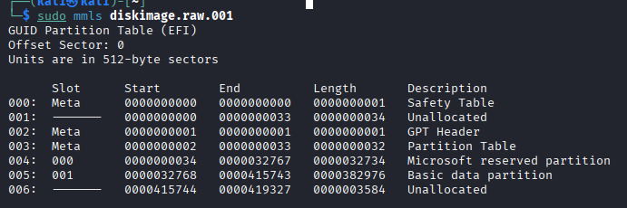

### 使用OS：Kali



1.Start列から001行にある０を抜いた数字を抜き出す（今回は32768）
- フラグファイルがないか探す
```bash
sudo fls -o 32768 -r diskimage.raw.001 | head -n 50 | grep flag

#
+++ r/r 69-128-1:       flag.rar
```

```bash
sudo icat -o 32768 diskimage.raw.001 69 > flag.rar
```
```bash
cat flag.rar
```
※開封注意

2.flag.rarの内容を確認（pngファイル発見）
```bash
unrar l flag.rar

#
UNRAR 7.20 beta 2 freeware      Copyright (c) 1993-2025 Alexander Roshal

Archive: flag.rar
Details: RAR 5

 Attributes      Size     Date    Time   Name
----------- ---------  ---------- -----  ----
*-rw-r--r--    101442  2024-04-29 01:42  flag.png
----------- ---------  ---------- -----  ----
               101442                    1
```
3.パスワード抽出

重要：flag.png は RAR のパスワードが必要
- password.txtの復元
```bash
sudo icat -o 32768 diskimage.raw.001 71 > password.txt
```
```bash
xxd password.txt

#
00000000: 5468 6520 7061 7373 776f 7264 2069 7320  The password is 
00000010: 7061 7373 776f 7264 0a                   password.

```
```bash
cat password.txt

#
The password is password
```

```bash
unrar password flag.rar
```
- RARを展開
```bash
unrar x flag.rar

#
UNRAR 7.20 beta 2 freeware      Copyright (c) 1993-2025 Alexander Roshal

Extracting from flag.rar

Enter password (will not be echoed) for flag.png: 

The specified password is incorrect.
Enter password (will not be echoed) for flag.png: 


Would you like to replace the existing file flag.png
101442 bytes, modified on 2024-04-29 01:42
with a new one
101442 bytes, modified on 2024-04-29 01:42

[Y]es, [N]o, [A]ll, n[E]ver, [R]ename, [Q]uit y

Extracting  flag.png                                                  OK 
All OK
```
4.抽出したpngファイルを閲覧
```bash
xdg-open flag.png
```

